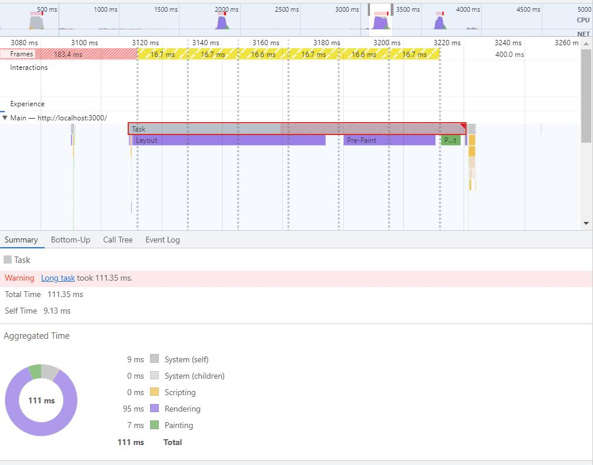

## TextLine

Компонент разбивает текст на две части и размещает их внутри флекс контейнера, первый элемент может сжиматься. Желаемое поведение достигается при помощи css. 

При изменении ширины внешнего контейнера ререндер компонента не происходит, поэтому сам компонент не добавляет времени перерисовки таблицы или иного контейнера, в котором он размещен. Для проверки времени перерисовки я вывел два столбца по 2000 строк, в сплит контейнер, при перетаскивании разделителя перерисовка на моем компьютере заняла 111мс - почти все время ушло на позиционирование и отрисовку, вклад js во время перерисовки - ничтожен.

